# 🗂️ EVMA - Smart Waste Management App

Sebuah aplikasi mobile-first untuk pengelolaan sampah pintar yang dibangun dengan ReactJS dan Firebase. Aplikasi ini menyediakan sistem manajemen sampah yang terintegrasi dengan fitur QR scanning, tracking timeline, sistem poin reward, dan leaderboard komunitas.

## 🌐 Link Demo

## 📱 Link Web (Mobile Version)

https://evma-web-mobile.vercel.app/

## 📦 QR-Code (For Get The Data with Scanner)

https://martivi-get-points.netlify.app/


## 🚀 Fitur Utama

### 📱 **Smart Waste Management**
- **QR Code Scanner** untuk identifikasi jenis sampah dan perhitungan poin otomatis
- **Real-time Timeline Tracking** untuk status pengolahan sampah
- **Waste Categories** dengan klasifikasi Wet Organic, Dry Organic, Non-Organic, dan Hazardous
- **Interactive Waste Statistics** dengan visualisasi data personal

### 🎁 **Reward System**
- **Points Collection** berdasarkan jenis dan jumlah sampah yang dibuang
- **Digital Wallet Integration** dengan GoPay, OVO, dan ShopeePay
- **Voucher & Gift Redemption** sistem tukar poin dengan reward
- **Charisma System** dengan ranking dan status pengguna

### 🗺️ **Smart Bin Mapping**
- **Interactive Map** dengan lokasi tempat sampah terdekat menggunakan React Leaflet
- **Real-time Bin Status** menampilkan kapasitas tempat sampah
- **GPS Location Services** untuk navigasi ke tempat sampah
- **Clustering System** untuk organisasi marker pada peta

### 👥 **Community Features**
- **Leaderboard System** dengan ranking berdasarkan poin dan aktivitas
- **Weekly Top Charisma** untuk pengguna terbaik
- **Social Connect** untuk membangun komunitas pengguna
- **Event Management** untuk kegiatan lingkungan

### ⚙️ **User Management**
- **Google Authentication** dengan Firebase Auth
- **User Profile Management** dengan foto dan informasi personal
- **Settings & Preferences** termasuk notifikasi dan bahasa
- **Secure Data Storage** dengan Firebase Firestore

---

## 🛠️ Teknologi yang Digunakan

### **Frontend Technologies**
- **ReactJS 18+** - Modern React dengan Hooks dan functional components
- **Material-UI (MUI)** - Component library untuk consistent design system
- **React Router DOM** - Client-side routing untuk SPA navigation
- **React Leaflet** - Interactive maps dengan OpenStreetMap integration
- **Framer Motion** - Smooth animations dan gesture handling
- **QR Scanner** - QR code scanning functionality

### **Backend & Database**
- **Firebase Authentication** - Google OAuth dan user management
- **Firebase Firestore** - NoSQL database untuk real-time data
- **Firebase Storage** - File storage untuk user photos dan assets
- **Firebase Analytics** - User behavior tracking dan app performance

### **Development Tools**
- **Create React App** - Project bootstrapping dan build tools
- **ESLint & Prettier** - Code linting dan formatting
- **Git** - Version control system
- **Netlify/Vercel** - Deployment platform

### **External APIs & Services**
- **OpenStreetMap** - Map tiles dan geographic data
- **Geolocation API** - User location services
- **Payment Gateway APIs** - Integration dengan digital wallets

---

## 🔄 Architecture & Component Structure

```mermaid
graph TD
    A[🚀 App.js - Main Router] --> B[🔐 Authentication Layer]
    B --> C[📱 Main Layout & Navigation]
    
    C --> D[🏠 Home Dashboard]
    C --> E[🎁 Rewards System]
    C --> F[🗺️ Bins Map]
    C --> G[👥 Connect Community]
    C --> H[⚙️ Settings]
    
    D --> I[📊 StatusPoints Component]
    D --> J[📷 QR Scanner Service]
    D --> K[📈 Timeline Tracking]
    D --> L[🗂️ Waste Categories]
    
    E --> M[💰 Points Display]
    E --> N[💳 Payment Options]
    E --> O[🎫 Voucher Cards]
    
    F --> P[🗺️ Leaflet Map]
    F --> Q[📍 Marker Clustering]
    F --> R[📱 GPS Services]
    
    G --> S[🏆 Leaderboard]
    G --> T[👤 User Profiles]
    
    H --> U[👤 Profile Management]
    H --> V[🔔 Notifications]
    H --> W[🌐 Language Settings]
    
    style A fill:#ff6b6b
    style J fill:#51cf66
    style P fill:#339af0
    style S fill:#ffd43b
```



---

## 🚀 Cara Menjalankan Project

### **Prerequisites**
- **Node.js 16+** dan npm/yarn package manager
- **Firebase Project** dengan Authentication, Firestore, dan Storage enabled
- **Google Maps API Key** (optional untuk enhanced mapping features)
- **Code Editor** (VS Code recommended)

### **Installation & Setup**

1. **Clone Repository**
   ```bash
   git clone https://github.com/username/evma-app.git
   cd evma-app
   ```

2. **Install Dependencies**
   ```bash
   npm install
   # atau
   yarn install
   ```

3. **Firebase Configuration**
   ```bash
   # Copy environment template
   cp .env.example .env
   
   # Edit .env file dengan Firebase config Anda
   nano .env
   ```

4. **Environment Variables Setup**
   Buat file `.env` di root directory dengan konfigurasi berikut:
   ```env
   # Firebase Configuration
   REACT_APP_FIREBASE_API_KEY=your_api_key_here
   REACT_APP_FIREBASE_AUTH_DOMAIN=your_auth_domain_here
   REACT_APP_FIREBASE_PROJECT_ID=your_project_id_here
   REACT_APP_FIREBASE_STORAGE_BUCKET=your_storage_bucket_here
   REACT_APP_FIREBASE_MESSAGING_SENDER_ID=your_messaging_sender_id_here
   REACT_APP_FIREBASE_APP_ID=your_app_id_here
   REACT_APP_FIREBASE_MEASUREMENT_ID=your_measurement_id_here
   ```

5. **Firebase Project Setup**
   - Buat project baru di [Firebase Console](https://console.firebase.google.com)
   - Enable Authentication dengan Google provider
   - Setup Firestore Database dengan rules yang sesuai
   - Enable Storage untuk file uploads
   - Copy configuration ke file `.env`

6. **Start Development Server**
   ```bash
   npm start
   # atau
   yarn start
   ```

   Aplikasi akan berjalan di `http://localhost:3000`

### **Firestore Database Rules**
```javascript
rules_version = '2';
service cloud.firestore {
  match /databases/{database}/documents {
    // Users collection
    match /Users/{userId} {
      allow read, write: if request.auth != null && request.auth.uid == userId;
    }
    
    // Public data (leaderboard, events)
    match /Events/{document=**} {
      allow read: if true;
      allow write: if request.auth != null;
    }
  }
}
```

### **Firebase Storage Rules**
```javascript
rules_version = '2';
service firebase.storage {
  match /b/{bucket}/o {
    match /users/{userId}/{allPaths=**} {
      allow read, write: if request.auth != null && request.auth.uid == userId;
    }
  }
}
```

---

## 📐 Firebase Integration Architecture

### **Authentication Flow**
```javascript
// src/auth/firebase.js
import { initializeApp } from 'firebase/app';
import { getAuth, GoogleAuthProvider, signInWithPopup } from 'firebase/auth';
import { getFirestore, doc, setDoc } from 'firebase/firestore';

// Firebase configuration dari environment variables
const firebaseConfig = {
  apiKey: process.env.REACT_APP_FIREBASE_API_KEY,
  authDomain: process.env.REACT_APP_FIREBASE_AUTH_DOMAIN,
  // ... other config
};

// Initialize Firebase services
const app = initializeApp(firebaseConfig);
export const auth = getAuth(app);
export const db = getFirestore(app);
```

### **User Data Structure (Firestore)**
```javascript
// Collection: Users/{userId}
{
  email: "user@example.com",
  firstName: "John Doe",
  photo: "https://...",
  points: 1250,
  bottles_count: 15,
  tins_count: 8,
  charisma: 114,
  createdAt: timestamp,
  lastActivity: timestamp
}
```

### **Real-time Data Synchronization**
```javascript
// src/hooks/useFirestore.js
import { useEffect, useState } from 'react';
import { doc, onSnapshot } from 'firebase/firestore';

export const useUserData = (userId) => {
  const [userData, setUserData] = useState(null);
  
  useEffect(() => {
    if (!userId) return;
    
    const unsubscribe = onSnapshot(
      doc(db, 'Users', userId),
      (doc) => setUserData(doc.data())
    );
    
    return () => unsubscribe();
  }, [userId]);
  
  return userData;
};
```

---

## 🎨 Component Structure & Design System

### **Main Components**
```
src/
├── components/
│   ├── Header.jsx              # App header dengan user info
│   ├── Navbar.jsx              # Bottom navigation
│   ├── StatusPoints.jsx        # Points display component
│   ├── Timeline.jsx            # Waste processing timeline
│   ├── ServiceButton.jsx       # QR scanner trigger
│   ├── Profile.jsx             # User profile display
│   └── icons/                  # SVG icon components
├── pages/
│   ├── Home.jsx                # Dashboard utama
│   ├── Rewards.jsx             # Reward & voucher system
│   ├── BinsMap.jsx             # Interactive map
│   ├── Connect.jsx             # Community features
│   ├── Settings.jsx            # App settings
│   ├── Scanner.jsx             # QR code scanner
│   └── Signup.jsx              # Authentication page
├── auth/
│   ├── firebase.js             # Firebase configuration
│   └── signInWithGoogle.jsx    # Google OAuth component
└── hooks/
    └── useGeolocation.jsx      # Custom hook untuk location
```

### **Styling Architecture**
```css
/* src/styles.css - Global styles */
@import url('https://fonts.googleapis.com/css2?family=Poppins:wght@400;500;600;700');

/* CSS Utilities untuk consistent design */
.text-head { font-size: 1rem; font-weight: 600; }
.nav-fill-active { fill: #019875; }
.card { border-radius: 12px; box-shadow: 0 4px 16px rgba(46, 130, 80, 0.12); }

/* Responsive grid system */
.grid-cols-2 { grid-template-columns: repeat(2, minmax(0, 1fr)); }
.flex { display: flex; }
.items-center { align-items: center; }
```

---

## 📱 Key Features Implementation

### **QR Code Scanning**
```javascript
// src/pages/Scanner.jsx
import QrScanner from 'qr-scanner';

const Scanner = () => {
  const videoRef = useRef();
  let scanner;

  useEffect(() => {
    scanner = new QrScanner(
      videoRef.current, 
      result => {
        const scannedData = JSON.parse(result.data);
        // Process scanned waste data
        updateUserPoints(scannedData);
      },
      { returnDetailedScanResult: true }
    );
  }, []);

  const startScanning = async () => {
    await scanner.start();
    // Handle scanning logic
  };
};
```

### **Real-time Map Integration**
```javascript
// src/pages/BinsMap.jsx
import { MapContainer, TileLayer, Marker, Popup } from 'react-leaflet';
import MarkerClusterGroup from 'react-leaflet-cluster';

const BinsMap = () => {
  const [userLocation, setUserLocation] = useState(null);
  
  useEffect(() => {
    navigator.geolocation.getCurrentPosition((position) => {
      setUserLocation([
        position.coords.latitude, 
        position.coords.longitude
      ]);
    });
  }, []);

  return (
    <MapContainer center={userLocation} zoom={16}>
      <TileLayer url="https://{s}.tile.openstreetmap.org/{z}/{x}/{y}.png" />
      <MarkerClusterGroup>
        {binLocations.map((bin, index) => (
          <Marker key={index} position={bin.coordinates}>
            <Popup>Filled {bin.filledPercentage}%</Popup>
          </Marker>
        ))}
      </MarkerClusterGroup>
    </MapContainer>
  );
};
```

### **Point System & Rewards**
```javascript
// src/components/StatusPoints.jsx
const StatusPoints = ({ points }) => {
  return (
    <div className="status-points-container">
      <div className="points-display">
        <span>Points</span>
        <span className="points-value">{points}</span>
      </div>
      <div className="charisma-display">
        <span>Charisma</span>
        <span className="charisma-value">114</span>
      </div>
    </div>
  );
};
```

---

## 🚨 Troubleshooting Guide

### **Common Firebase Issues**

#### **1. Authentication Errors**
- **Penyebab:** Firebase config salah atau domain tidak terdaftar
- **Solusi:** 
  - Periksa konfigurasi di `.env` file
  - Tambahkan domain ke Authorized domains di Firebase Console
  - Pastikan Google OAuth enabled di Authentication

#### **2. Firestore Permission Denied**
- **Penyebab:** Database rules terlalu ketat atau user tidak authenticated
- **Solusi:**
  - Periksa Firestore Security Rules
  - Pastikan user sudah login sebelum akses data
  - Test rules di Firebase Console

#### **3. Environment Variables Not Loading**
- **Penyebab:** File `.env` tidak ditemukan atau variabel tidak dimulai dengan `REACT_APP_`
- **Solusi:**
  - Pastikan file `.env` ada di root directory
  - Semua variabel harus diawali dengan `REACT_APP_`
  - Restart development server setelah perubahan

#### **4. Map Not Loading**
- **Penyebab:** CSS Leaflet tidak ter-import atau network issue
- **Solusi:**
  - Pastikan `import 'leaflet/dist/leaflet.css'` ada
  - Periksa koneksi internet untuk map tiles
  - Check browser console untuk JavaScript errors

#### **5. QR Scanner Not Working**
- **Penyebab:** Camera permissions atau HTTPS requirement
- **Solusi:**
  - Pastikan aplikasi berjalan di HTTPS (production)
  - Allow camera permissions di browser
  - Test di browser yang support WebRTC

---

## 🔐 Security & Best Practices

### **Environment Security**
- ✅ Semua sensitive data disimpan di environment variables
- ✅ File `.env` tidak di-commit ke repository
- ✅ Firebase API keys untuk web aman untuk public exposure
- ✅ Database rules membatasi akses berdasarkan authentication

### **Code Quality**
- ✅ Component-based architecture untuk reusability
- ✅ Custom hooks untuk logic separation
- ✅ Error boundaries untuk error handling
- ✅ TypeScript ready structure (dapat di-migrate)

### **Performance Optimization**
- ✅ Lazy loading untuk components besar
- ✅ Image optimization dengan loading="lazy"
- ✅ Efficient re-renders dengan proper dependency arrays
- ✅ Firebase realtime listeners dengan cleanup

---

## 🔮 Future Enhancements

### **Planned Features**
- **Push Notifications** untuk reminder dan updates
- **Offline Mode** dengan service workers dan local storage
- **Advanced Analytics** dengan detailed user behavior tracking
- **Multi-language Support** untuk internasionalization
- **Dark Mode** untuk better user experience
- **Admin Dashboard** untuk content management

### **Technical Improvements**
- **TypeScript Migration** untuk better type safety
- **Testing Suite** dengan Jest dan React Testing Library
- **CI/CD Pipeline** dengan GitHub Actions
- **Performance Monitoring** dengan Firebase Performance
- **Error Tracking** dengan Sentry integration
- **PWA Features** untuk app-like experience

### **Sustainability Features**
- **Carbon Footprint Tracking** untuk environmental impact
- **AI-powered Waste Classification** untuk better accuracy
- **Blockchain Integration** untuk reward token system
- **IoT Integration** dengan smart waste bins
- **Corporate Partnerships** untuk enterprise features

---

## 🙏 Acknowledgments

- **Firebase** untuk backend infrastructure yang powerful
- **React Leaflet** untuk interactive mapping solution
- **Material-UI** untuk consistent design components
- **QR Scanner** library untuk barcode scanning functionality
- **Open Source Community** untuk tools dan resources yang luar biasa

---

**Built with 💚 for a sustainable future**

*Smart waste management solution untuk menciptakan lingkungan yang lebih bersih dan sustainable melalui teknologi modern dan community engagement.*